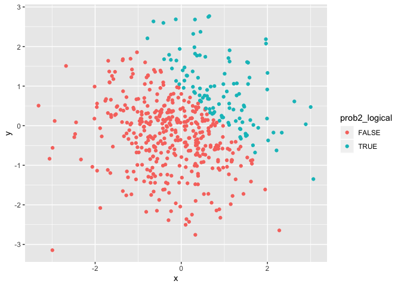

Homework Problem
================

# Problem1

## Create a dataframe:

``` r
prob1_df = tibble (
  prob1_sample = rnorm(8, mean=0, sd = 1),
  prob1_sample_over0 = prob1_sample > 0,
  prob1_char = c("I","Am", "A", "Little", "Confused", "Is", "This", "Right"),
  prob1_factor = factor(c("yes", "no", "maybe", "yes", "no", "maybe", "yes", "no"))
)
```

## Try to take the mean of each variable:

  - The mean of the sample size is -0.3039969.

  - The mean of the logical statement is 0.25.

  - The mean of the character vector is NA.

  - The mean of the factor vector is NA.

We were able to take the mean of the first two variables because they
are numeric. However, we could not take the mean of the character or
factor vector because they were text and not numeric.

## Convert Code Chunk to Numeric

``` r
as.numeric(pull(prob1_df, prob1_sample_over0))
as.numeric(pull(prob1_df, prob1_char))
as.numeric(pull(prob1_df, prob1_factor))
```

I was able to convert the logical statement and factor vector to
numeric, but not the character vector. This does not completely explain
why I was unable to take the mean of
the

## Second Code Chunk

``` r
as.numeric(pull(prob1_df, prob1_sample_over0))*pull(prob1_df, prob1_sample)
```

    ## [1] 0.0000000 2.0448511 0.0000000 0.8531024 0.0000000 0.0000000 0.0000000
    ## [8] 0.0000000

``` r
as.factor(pull(prob1_df, prob1_sample_over0))*pull(prob1_df, prob1_sample)
```

    ## Warning in Ops.factor(as.factor(pull(prob1_df, prob1_sample_over0)),
    ## pull(prob1_df, : '*' not meaningful for factors

    ## [1] NA NA NA NA NA NA NA NA

``` r
as.numeric(as.factor(pull(prob1_df, prob1_sample_over0)))*pull(prob1_df, prob1_sample)
```

    ## [1] -0.2941295  4.0897022 -0.6385533  1.7062048 -2.5305798 -0.1749620
    ## [7] -0.4040911 -1.2876128

# Problem 2

``` r
prob2_df = tibble(
  x = rnorm(500, mean = 0, sd = 1),
  y = rnorm(500, mean = 0, sd = 1),
  prob2_logical = (x + y) > 1,
  prob2_nvector = as.numeric(prob2_logical),
  prob2_fvector = as.factor(prob2_logical)
)
```

## Describing the newly created data frame

  - This dataset contains 500 rows and 5 columns

  - the mean of x is -0.0333709

  - the median of x is -0.0224894

  - the standard deviation of x is 1.0129796

  - the proportion of cases for which x + y \> 1 is
0.216

## Graph for Problem 2

``` r
ggplot(prob2_df, aes(x = x, y = y, color = prob2_logical)) + geom_point()
```

<!-- -->
