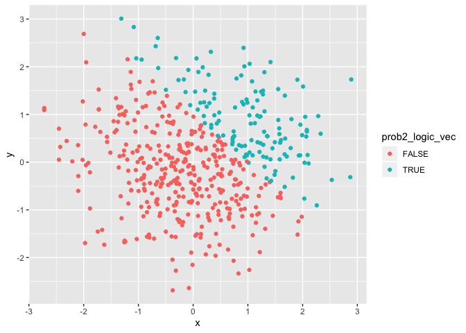
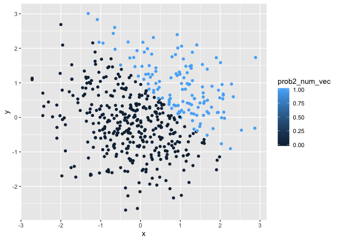
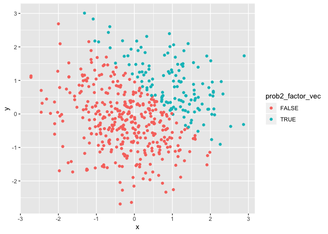

Homework \# 1
================
Holly Finertie (HF2379), Due:
2019-09-20

# Problem1

## Create a dataframe:

``` r
prob1_df = tibble (
  prob1_sample = rnorm(8, mean=0, sd = 1),
  prob1_sample_over0 = prob1_sample > 0,
  prob1_char = c("I","Am", "A", "Little", "Confused", "Is", "This", "Right"),
  prob1_factor = factor(c("yes", "no", "maybe", "yes", "no", "maybe", "yes", "no"))
)
```

## Try to take the mean of each variable:

  - The mean of the sample size is 0.0197641.

  - The mean of the logical statement is 0.375.

  - The mean of the character vector is NA.

  - The mean of the factor vector is NA.

We were able to take the mean of the first two variables because they
are numeric. However, we could not take the mean of the character or
factor vector because they were text and not numeric.

## Convert Code Chunk to Numeric

``` r
as.numeric(pull(prob1_df, prob1_sample_over0))
as.numeric(pull(prob1_df, prob1_char))
as.numeric(pull(prob1_df, prob1_factor))
```

I was able to convert the logical statement and factor vector to
numeric, but not the character vector. This does not completely explain
why I was unable to take the mean of
the

## Second Code Chunk

``` r
as.numeric(pull(prob1_df, prob1_sample_over0))*pull(prob1_df, prob1_sample)
```

    ## [1] 1.7188590 0.0000000 0.0000000 1.3644171 0.6082492 0.0000000 0.0000000
    ## [8] 0.0000000

``` r
as.factor(pull(prob1_df, prob1_sample_over0))*pull(prob1_df, prob1_sample)
```

    ## Warning in Ops.factor(as.factor(pull(prob1_df, prob1_sample_over0)),
    ## pull(prob1_df, : '*' not meaningful for factors

    ## [1] NA NA NA NA NA NA NA NA

``` r
as.numeric(as.factor(pull(prob1_df, prob1_sample_over0)))*pull(prob1_df, prob1_sample)
```

    ## [1]  3.4377180 -0.9292944 -1.1350257  2.7288342  1.2164985 -1.0547636
    ## [7] -0.3088940 -0.1054346

# Problem 2

``` r
prob2_df = tibble(
  x = rnorm(500, mean = 0, sd = 1),
  y = rnorm(500, mean = 0, sd = 1),
  prob2_logical = (x + y) > 1,
  prob2_nvector = as.numeric(prob2_logical),
  prob2_fvector = as.factor(prob2_logical)
)
```

## Describing the newly created data frame

  - This dataset contains 500 rows and 5 columns

  - the mean of x is 0.015547

  - the median of x is -0.0030035

  - the standard deviation of x is 0.9920914

  - the proportion of cases for which x + y \> 1 is
0.234

## Plots for Problem 2

``` r
plot1 = ggplot(prob2_df, aes(x = x, y = y, color = prob2_logical)) + geom_point()
plot1
```

<!-- -->
\* This plot has two colors, red and blue, for FALSE and TRUE,
respectively. That’s because the color assignments are based on the
values for our logical vector which is either TRUE or
FALSE.

``` r
plot2 = ggplot(prob2_df, aes(x = x, y = y, color = prob2_nvector)) + geom_point()
plot2
```

<!-- -->

  - This plot has a range of colors for our range of values between 1
    and 0. This color is numeric and therefore has a range of values.
    But since this was built off of our logical vector (TRUE, FALSE), we
    only see values for 1 and 0
.

<!-- end list -->

``` r
plot3 = ggplot(prob2_df, aes(x = x, y = y, color = prob2_fvector)) + geom_point()
plot3
```

<!-- -->

  - This plot has two colors, red and blue, for FALSE and TRUE,
    respectively. That’s because the color assignments are based on the
    values for our factor vector which are either TRUE or FALSE.

## Saving my scatterplots

``` r
ggsave(plot1, file = "plot1.png")
```

    ## Saving 7 x 5 in image

``` r
ggsave(plot2, file = "plot2.png")
```

    ## Saving 7 x 5 in image

``` r
ggsave(plot3, file = "plot3.png")
```

    ## Saving 7 x 5 in image

## Done with HW 1\!
